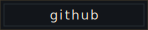
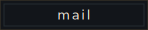
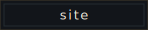
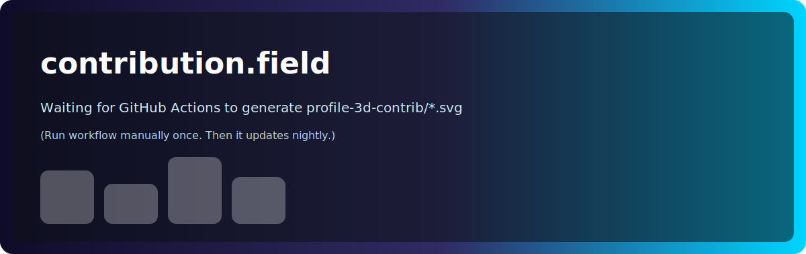

<!-- =========================================================
  HYV // UMBRAL PROFILE
  Everything is generated inside this repo (no external widgets).
========================================================== -->

<p align="center">
  
</p>

<p align="center">
  <sub><b>Operator:</b> Hyv • <b>Stack:</b> Rust / TypeScript / Python • <b>Directive:</b> ship tools, kill friction</sub>
</p>

<p align="center">
  <a href="https://github.com/ishyv">
    
  </a>
  <a href="mailto:ishyv@proton.me">
    
  </a>
  <a href="https://hyvnt.dev">
    
  </a>
</p>

---

## boot.log

```txt
[ OK ] identity: Hyv
[ OK ] role: systems/tooling dev (bots, automation, CLIs)
[ OK ] bias: minimalism > feature soup
[WARN] caffeine dependency detected
```

<details>
  <summary><b>Focus</b></summary>

- Discord bots & infra tooling  
- Automation that makes future-me smug  
- Rust when it matters, TypeScript when it pays, Python when it ships

</details>


<p align="center">
  
</p>


<p align="center">
  
</p>


<p align="center">
  
</p>

---

<details>
  <summary><b>Hidden panel</b></summary>

If you’re reading this: It's time to get a j*b

</details>
