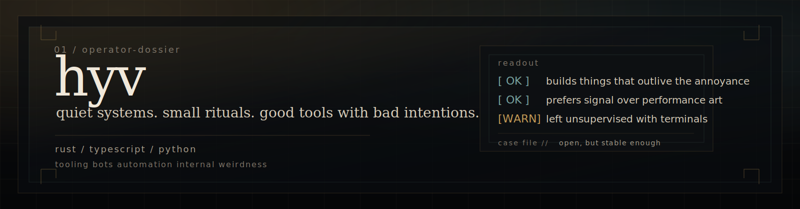
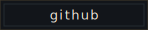
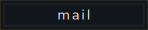
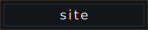
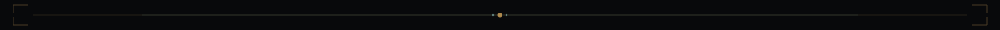
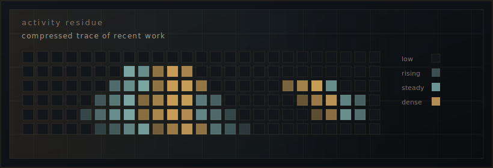
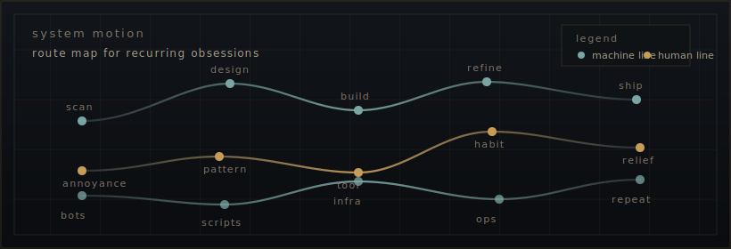

<!-- =========================================================
  HYV // OPERATOR DOSSIER
  Built for GitHub's markdown sandbox. No widgets. No filler.
========================================================== -->

  

  <code>operator: hyv</code> &nbsp; <code>zone: tooling / bots / automation</code> &nbsp; <code>status: mostly contained</code>

  
  
  

  

<table>
  <tr>
<td width="54%" valign="top">

<code>01 / brief</code>

<pre lang="txt">
[ OK ] builds strange useful things
[ OK ] prefers quiet software
[ OK ] keeps the sharp parts on purpose
[WARN] may romanticize terminals a little
</pre>

<i>i like tools that feel old enough to trust and mean enough to bite.</i>

</td>
<td width="46%" valign="top">

<code>02 / notes</code>

- rust when the rules matter
- typescript when the mess needs a leash
- python when the door will not open politely
- bots, internal tools, automation, small systems with a pulse

minimalism, but not the fake sterile kind.

</td>
  </tr>
</table>

  

<code>03 / telemetry</code>

  

<table>
  <tr>
<td width="50%" valign="top">

<code>04 / residue</code>

  

</td>
<td width="50%" valign="top">

<code>05 / motion</code>

  

</td>
  </tr>
</table>

  

  
<code>06 / sealed remarks</code>

   

  if something here looks too deliberate, that is because it is.
   
  if something here looks slightly ominous, that is also deliberate.

