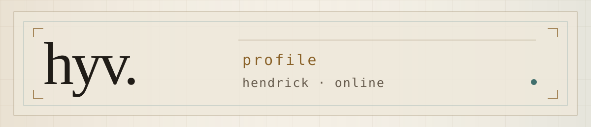

<picture>
  <source media="(prefers-color-scheme: dark)" srcset="assets/masthead-dark.svg">
  <source media="(prefers-color-scheme: light)" srcset="assets/masthead-light.svg">
  
</picture>

> i’m hendrick. hyv online.
>
> i make tools, games, and the occasional language. usually because something was annoying me.

## `01 / things i made`

### A-01 · [`darkh-bot`](https://github.com/ishyv/darkh-bot) · 2021

first discord bot. still public.

### A-02 · [`lang`](https://github.com/ishyv/lang) · 2024

a small scripting language. it transpiles to JavaScript.

### A-03 · [`revenant`](https://github.com/ishyv/revenant) · 2025

a CLI for Rust, wasm, and SvelteKit.

### A-04 · [`hyvui`](https://github.com/ishyv/hyvui) · 2026

a UI library. i wanted defaults i could live with.

### A-05 · [`ashenmoon`](https://github.com/ishyv/ashenmoon) · 2026

a dark-fantasy survival RPG. still in progress.

## `02 / recently disturbed`

<picture>
  <source media="(prefers-color-scheme: dark)" srcset="https://raw.githubusercontent.com/ishyv/ishyv/generated/cabinet-trace-dark.svg">
  <source media="(prefers-color-scheme: light)" srcset="https://raw.githubusercontent.com/ishyv/ishyv/generated/cabinet-trace-light.svg">
  
</picture>

> more later, probably.

<a href="https://hyvnt.dev">site</a> · <a href="mailto:ishyv@proton.me">mail</a>
